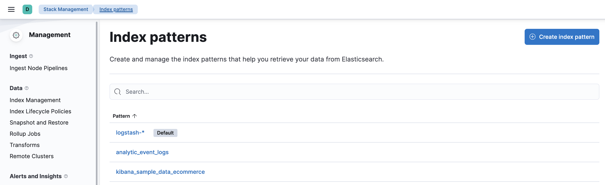
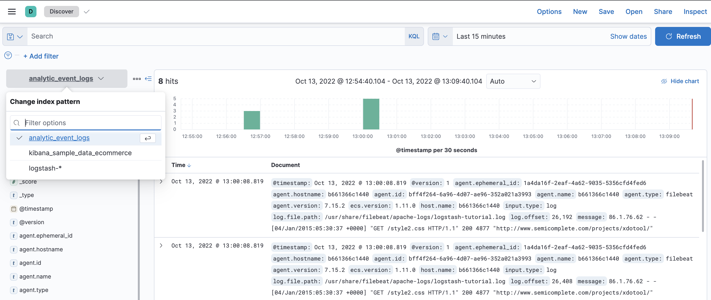

# log-aggregation-pipeline-test

## Overview

This log aggregation pipeline is a replica of [the previous pipeline](https://github.com/tintinrevient/log-aggregation-pipeline) with the ELK version upgraded from `6.4.0` to `7.15.2`.

The checklist is as below to make sure it works as expected:

1. Check if the indices have been created in `elasticsearch` in http://localhost:9200/_cat/indices with status `green`.

2. Execute the following HTTP request in `kibana`'s dev tools in http://localhost:5601/app/dev_tools#/console to make the desired index `green`:
```
PUT analytic_event_logs/_settings
{
  "index.number_of_replicas": 0
}
```

3. Create the index patterns in `kibana`'s stack management in http://localhost:5601/app/management/kibana/indexPatterns:
<p float="left">
  
</p>

4. Show the logs in `kibana`'s discover with the desired index pattern:
<p float="left">
  
</p>

## References

* https://stackoverflow.com/questions/56130362/kibana-doesnot-shows-yellow-marked-elastic-search-indexes-in-discover-tab
